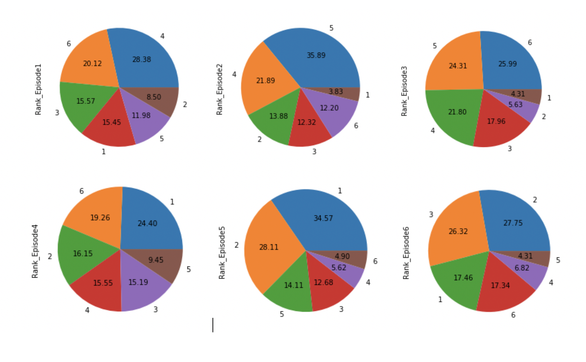
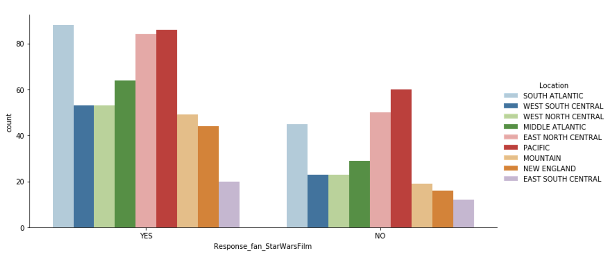
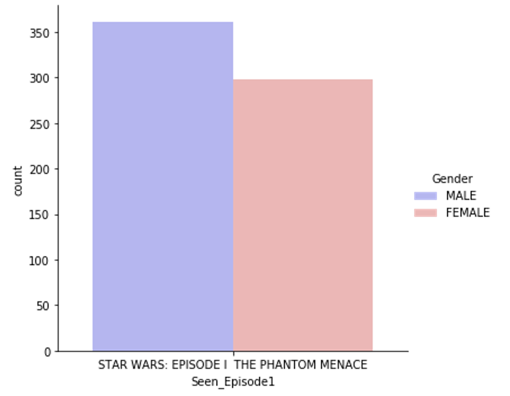
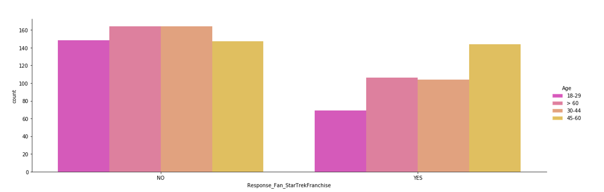
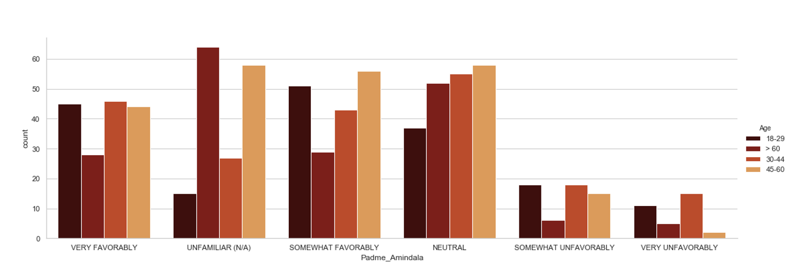
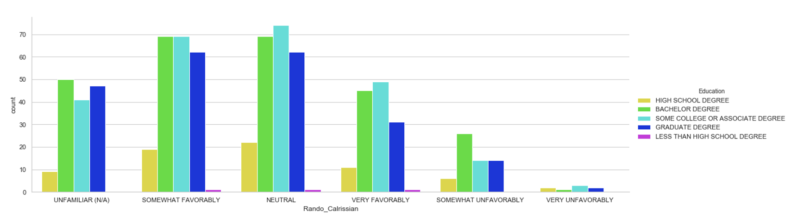
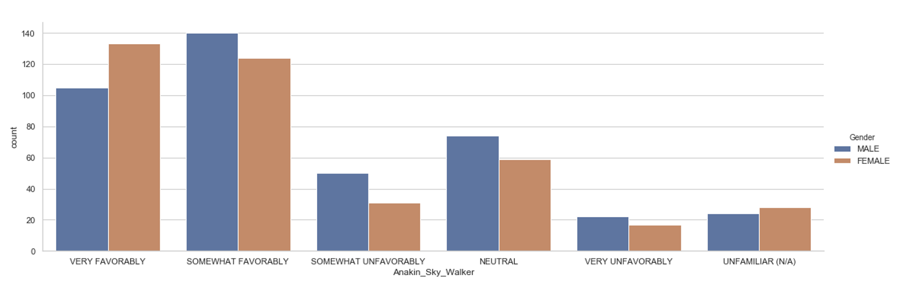
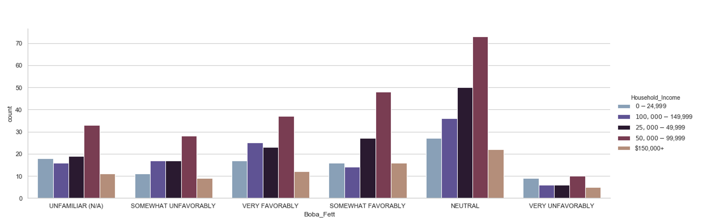
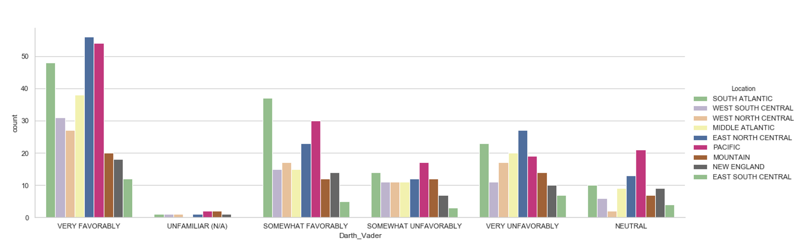

## 1.	DATA PREPARATION
The initial step to work with data is to clean and organise data according to our requirements and then process data for data analysis. Data present in Star Wars dataset has to be checked if any form of inaccuracy exists which has to be removed or can be removed in order to clean data. Raw data can have many inaccuracies like wrong index values, unnecessary rows or columns, unnamed columns, incorrect entries, typos, extra white-spaces, empty cells, etc. Preparing data for analysis requires data cleaning. We clean data using various inbuilt functions in python to deal with such inaccuracies. In Star Wars data set, we’ve to see what all inaccuracies exist. StarWars.csv file contains survey questions related to if a person has seen any of the six films from Star Wars Franchise, if they consider themselves as fan of Star Wars films, which all films have they seen, how would they rank the films from 1 to 6 with 1 being their favourite film and 6 being the least favourite film in the franchise, reviews for characters from the film, if they are familiar with expanded universe, if they consider themselves to be fan of expanded universe and Star Trek franchise and details about people’s demographics such as location, age, gender, household income and education. 

### 1.1	Data Retrieving
To access data from a data set, data has to be loaded from the csv file to Jupyter python notebook. For this, we use pandas library read_csv() function, in which we have to put StarWars.csv as the name of the file since the file is in csv format. We have to specify parameters such as sep to identify the character as separator, decimal to identify character as decimal, header as None and names for assigning names to columns.  Now to see if data is loaded we type StarWars and run it. We provide encoding=‘ISO-8859-1’, to read data from the csv file since it wasn’t able to read data if we didn’t provide encoding. After data is loaded in Jupyter notebook, we can now check data. Libraries such as pandas, matplotlib.pyplot, numpy and seaborn have to be loaded in beginning. 

### 1.2	Check Data Types
To check data types of every column, we use dtypes. StarWars.dtypes gives us the name of columns and their respective datatype in front of the column name. Each column name was observed to be of object data type. Every column consisted of categorical data.

### 1.3	Typos
We have to count number of unique entries that occur in a column by using value_counts() function. Any typographical error can be removed by replacing the incorrect string by correct string using replace() function. For example, there are three entries in a column: ‘Yess’, ‘Yes’ and ‘No’. Here, ‘Yess’ is a wrong entry and the only entries that should be in a column are ‘Yes’ and ‘No’. So, we’ll replace ‘Yess’ with ‘Yes’ and then, use value_counts() function to check if the incorrect entry is replaced by correct entry or not and then see the total number of ‘Yes’ and ‘No’ from that particular column. In StarWars data set, around 5 columns had typos which had to be corrected. Typos were removed columns Response_Fan_of_ExpandedUniverse, Response_fan_StarWarsFilm, Response_Fan_StarTrekFranchise, and Age from StarWars data frame. 

### 1.4	Extra Whitespaces
Columns containing string values sometimes, have extra white spaces. A white space is extra blank space before or after a string which cannot be seen but has to be removed. For this, str.strip() function is used that clears the extra white spaces present at the end or beginning of the string. In StarWars dataset, white spaces were removed from every column using this function.

### 1.5	Upper/Lower-case
All the columns containing lower case text/string entries is changed to upper-case text in StarWars dataframe. This is done by using str.upper() function.

### 1.6	Sanity checks
There exists values which has no meaning or impossible values or practically not possible which has to be removed while performing sanity check on any data frame. In StarWars data set, there is a value 500 in Age column which is not possible. A person cannot be 500 years old. To remove that entry, we replace ‘500’ by ‘> 60’ in Age column by using replace() function. 

### 1.7	Missing Values
In any column, if there is an empty value or no value or blank entry, it is known as a missing value. Any blank entry is replaced by ‘NaN’ using replace() function. To deal with missing values, we use dropna() function to drop all entries that contain NaN. 
 
## 2.	DATA EXPLORATION
### 2.1	Explore A Survey Question
A survey question “Please rank the Star Wars films in order of preference with 1 being your favorite film in the franchise and 6 being your least favorite film” has responses from numbers 1 to 6. These numbers represent ranks given by people to six films in franchise. For examining the responses, we have to select data from a particular column. Suppose, we have to analyse the number of ranks given to Star Wars Episode I: The Phantom Menace. To calculate total number of ranks, we use value_counts() function and get following entries: 
4    237
6    168
3    130
1    129
5    100
2     71
The above entries indicate, around 237 people have ranked Episode I: The Phantom Menace as 4. And 129 people have ranked Episode I as 1. To visually analyse this data, we can plot a pie chart using following code:
StarWars['Rank_Episode1'].value_counts().plot(kind='pie',autopct='%.2f')
plt.show()
Similarly, to plot pie charts for Star Wars: Episode II Attack of the Clones, Star Wars: Episode III Revenge of Sith, Star Wars: Episode IV A New Hope, Star Wars: Episode V The Empire Strikes Back, Star Wars: Episode VI Return of Jedi, we simply change the column name in code given above. Figure 1 shows pie chart for ranks given to every Star Wars film.
   

Figure 1: Pie Charts for Ranks(1 to 6) given to every Star Wars film
### 2.2	Relationships Between Columns
Survey questions asked for if a person has seen any of the six films, if they consider themselves to be fan of the Star Wars franchise, which all films have they seen from Star Wars franchise, if they saw different characters from movies as favourable, very favourable, somewhat favourable, unfavourable or are unfamiliar with the character, if they consider themselves to be fan of Star Trek, if they are fan of Expanded universe, if they are familiar with Expanded Universe, their gender, age, household income, location and education. All these columns had data that can be distributed in various categories. For establishing a relationship, two columns are selected and we plot a visualisation from which we can easily analyse the data. If suppose, we take Response_fan_StarWarFilms and Location as two columns between which we have to plot a graph. We first observe what type of entries these columns have. Response_fan_StarWarsFilms stores the answers to the question if a person considers himself to be a fan of Star Wars Films. And Location column consists the location to which a particular person belongs. So, Response_fan_StarWarsFilms includes ‘Yes’ and ‘No’ entries and Location includes ‘South Atlantic’, ‘West South Central’, ‘West North Central’, ‘Middle Atlantic’, ‘East North Central’, ‘Pacific’, ‘Mountain’, ‘New England’ and ‘East South Central’ entries. Previously, we cleared whitespaces and typos for plotting the right data. We use seaborn library for dealing with categorical data. To depict a visualisation, we write the following code:
sns.catplot(x='Response_fan_StarWarsFilm', kind='count', hue='Location', data=StarWars, aspect=2, palette='Paired')
This gives us count plot in which, x-axis represents Location-wise ‘Yes’ and ‘No’ responses and hue, y-axis represents counts of responses. Data is extracted from StarWars dataset. We use aspect for size of graph and assign palette as paired(which is name of palette in seaborn library). Figure 2 represents the countplot from above code: 

Figure 2: Star Wars films fanbase on the basis of people’s location
 

After plotting the above graph, we observe most fans of Star Wars films belong to South Atlantic area i.e. highest number of people who consider themselves as fan of Star Wars films come from South Atlantic region whose responses were recorded as Yes. Many fans were observed in East North Central and Pacific region as well. Least number of fans were seen in East South Central region. Most number of No i.e people who don’t consider themselves as fan of Star Wars film were seen Pacific region. Minimum number of No responses were recorded in East South Central.

Similarly, we can plot countplot for other columns too. Consider Seen_Episode1 and Gender columns for our next visualisation. Seen_Episode1 comprise of ‘Star Wars: Episode I The Phantom Menace’ entries and Gender comprise of ‘Male’ or ‘Female’ entries. Again, the data is observed to be categorical in these columns therefore, we use seaborn library and plot a graph for this. Code for this is same as our previous plot but we assign x-axis as Seen_Episode1 and hue as Gender. We change the aspect to 1 and color palette to bwr.
sns.catplot(x='Seen_Episode1', kind='count', hue='Gender', data=StarWars, aspect=1, palette='bwr')

The visualisation generated from above code can be seen in Figure 3. 

 

Figure 3: Count of people who watched Episode I based on their gender

From the above plot, we can infer that number of males saw Episode I The Phantom Menace more than number of females.

Another two columns, Response_Fan_StarTrekFranchise and Age if considered, we notice Response_Fan_StarTrekFranchise column consist of ‘Yes’ and ‘No’ responses and Age is divided into ‘18-29’, ‘30-44’, ‘45-60’ and ‘>60’ categories. To illustrate a graph for these two columns, following code was used:
sns.catplot(x='Response_Fan_StarTrekFranchise', kind='count', hue='Age', data=StarWars, aspect=3, palette='spring')
Figure 4 shows the count plot for Response_Fan_StarTrekFranchise and Age.

 
Figure 4: Fanbase of Star Trek Franchise categorised according to the age of people

This plot shows that maximum number people who answered Yes were observed in 45-60 age group and minimum number of people who answered Yes were observed in 18-29 age group. For people who answered No, equal number of responses were observed for 30-44 and above 60 age groups.

### 2.3	Explore Specific Relationship
In this task, we have to plot graphs to compare people’s demographics and their attitude towards the Star Wars characters. People’s demographics include ‘Age’, ‘Location’, ‘Household_Income’, ‘Gender’ and ‘Education’ columns. The 14 characters are Anakin Sky Walker, Boba Fett, C3PO, Darth Vader, Emperor Palpatine, Han Solo, Jar Jar Binks, Luke Sky Walker, Obi Wan Kenobi, Padme Amindala, Princess Leia Organa, R2D2, Rando Calrissian and Yoda. Response for people’s attitude towards every of these characters is recorded as ‘Very favorably’, ‘Somewhat favorably’, ‘Neither favorably nor unfavorably’, ‘Somewhat unfavorably’ and ‘Unfamiliar’. Every demographics is divided into categories. For example if we take Education, it is categorised into ‘High School Degree’, ‘Bachelor Degree’, ‘Some College or Associate Degree’, ‘Graduate Degree’ and ‘Less than High School Degree’. Now to explore specific relationship, we take one character and compare it to people’s demographics. Correspondingly, if we choose ‘Padme_Amindala’ and compare this column to ‘Age’, we get the following graph:

 
Figure 5: Attitude of people towards Padme Amindala based on their Age

We can infer from the above plot that people who were 60 and above are unfamiliar with Padme Amindala. Most of the people were neutral with her from almost all age groups. Only few of them rated her very unfavourably. Approximately, 45 people belonging to the age group of 30-44 and 45-60 each very fond of her. In contrast to this,  least number of people from age group 45-60 ranked her very unfavourably.
Similarly, following graphs were plotted for different characters compared to different demographics.

 
Figure 6: Attitude of people towards Rando Calrissian based on their Education

When we consider responses for Rando Calrissian and compare this character to Education that is shown in above plot(Figure 6), we infer that people who have some college or associate degree have highly rate Rando Calrissian as neutral. The count plot reflects huge number of people who had Bachelor’s degree or had some or associate degree were either somewhat favourable or neutral. There were very few responses recorded as very unfavourably. Only a negligent amount of people having less than high school degree were either somewhat favourable, neutral or very favourable.

 
Figure 7: Attitude of people towards Anakin Sky Walker based on their Gender

In figure 7, people’s attitude towards Anakin Sky Walker by gender is shown. Most males consider Anakin Sky Walker to be somewhat favourable whereas most female rated her as very favourable. Less than 20 female rated her character as very unfavourable. Near about 60 female and less than 80 male were neutral towards her character.

Figure 8: Attitude of people towards Boba Fett based on their Housholed income

The above graph shown in Figure 8 depicts people’s reviews for Boba Fett character with different household income. Maximum number of people whose income lies between $50,000 to $99,999 were neutral towards Boba Fett.  There were very less number of people from all categories of household income, that voted very unfavourably for him. Approximately 20 people from $0-$24,999, $100,000-$149,999 and $25,000-$49,999 categories of household income each were unfamiliar with the character.

 
Figure 9: Attitude of people towards Darth Vader based on their Location

Most number of people from Pacific and East North Central region were very favourable towards Darth Vader and only a small percentage of people from all locations said that they were unfamiliar with the character. Approximately 10 number of people from West South Central, West North Central and Middle Atlantic voted somewhat unfavourable for his character.
 

## 3.	REFERENCES
1.	Boschetti, A & Massaron, L 2015, Python Data Science Essentials, Packt Publishing Ltd., viewed 17  April, <shttps://books.google.com.au/books?id=Y4rwCAAAQBAJ&printsec=frontcover#v=onepage&q&f=false>.

